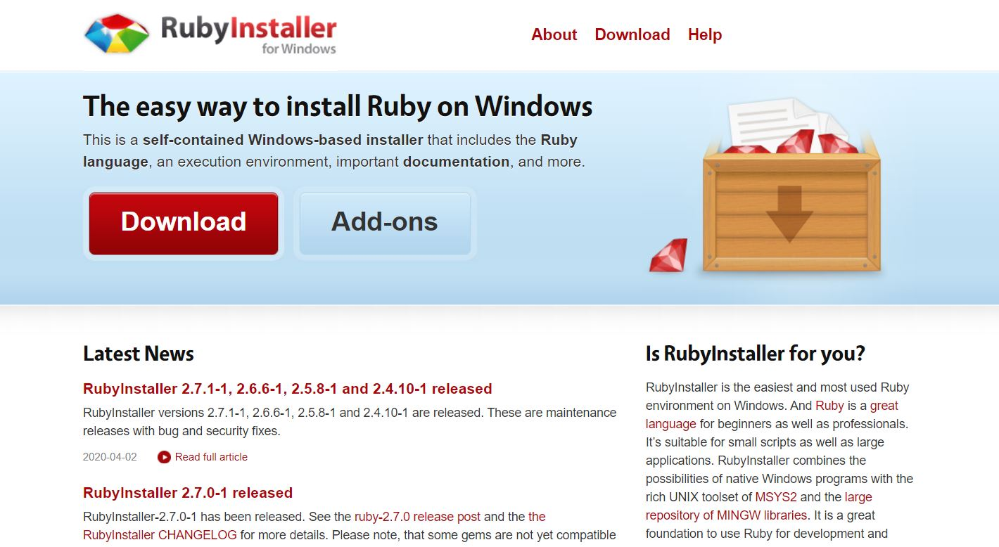
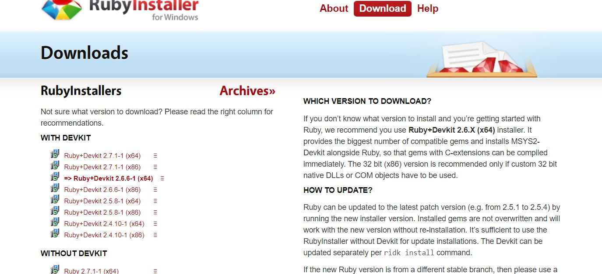

雖然之前用過幾個寫文章的平台，也架過一些網站，但終於以個人的名義弄了一個屬於自己的空間，心情還是蠻興奮的。即使現在似乎有不少人是用Heroku或是Hexo等方式搭配，我仍想用用看被GitHub支持的Jekyll。

這次方式是在 Win10中使用 githubpage + Jekyll的方式建置我的網站。必須先聲明一下我的對這部分的了解程度：雖然我有架設網站的經驗，程式語言也有基礎概念，但這部分對我來說是完全陌生的領域……　所以這篇可以說是瞎子摸象的純紀錄，之後發生什麼問題回頭過來看的。

---

Jekyll是一個靜態網站生成器，可以根據Markdown文件自動生成靜態的html文件。最重要的是github支持這項服務。我現在還是似懂非懂，只知道好像省了不少步驟，又免費（重點XD）、簡單、好用。

## 安裝jekyll

因為Jekyll是基於Ruby環境開發的，所以要使用的話自己的環境也得有個Ruby。
安裝[Ruby](https://rubyinstaller.org/)
進去我就點Download，看了一下旁邊的說明文字就下載了粗體的那個。

安裝過程中的預設我都沒改，盲人安裝法哈哈。裝完之後會跳出這個，他說不確定就按enter，所以我就不用腦按了enter。

主要注意Ruby的版本必須是2.0.0以上。
可以使用指令確認

接著開啟剛裝好的start command prompt with ruby
確定一下Gem有沒有正常運作，也是看看版本：
```
gem -v
```
Gem是Ruby的套件安裝與管理的套件，而Jekyll要透過Gem來安裝與管理。我沒用過也是略懵，暫時把它想成windows裡面的安裝與管理程式，這樣好理解一點（不要太信我啊，不確定有沒有觀念錯誤）。
剛剛確認Gem可以正常運作了，接著就更新它：
```
gem update --system
```

到目前為止正常來說應該都順利，可以開始透過gem去安裝Jekyll了！
```
gem install jekyll
```

安裝完後一樣看一下版本確認有沒有安裝到：
```
jekyll -v
```

## 建置網站

接著用jekyll建立一個新的專案。至於github page的相關設置這裡先不多獎。要提醒的是，如果你之前已經有建立自己的資料夾，或是有要指定儲存位置的話，記得要改一下路徑。

（像我就是東西都裝在C槽，但那時有先建網站的相關的資料夾放在D槽，所以這裡的工作位置也是建置位置就選D槽）
```
jekyll new mynew #mynew就是你新建的專案名字
```
再來我們用jekyll server在本機看自己的網站
```
cd mynew #進去你專案的路徑
jekyll serve
```
接著就在網址輸入 http://127.0.0.1:4000/　
如果沒錯誤，就可以在本機看到你網頁的樣子了，應該會發現jekyll給了一個預設的樣式。
再來就是看一下資料夾裡面的結構，像是有個 _posts 資料夾就是放文章用的，還有404、關於等等的簡單頁面。至於網站架構就是之後自己要去規劃了。

## 推上去git

先前已經有新增好專案了，再來只是推上去而已。我git也不是很熟，只會基本的，所以紀錄一下這邊會用到的指令。
git init #把專案目錄初始化，加入版本控制（第一次推）
```
git add . #把當前資料夾的內容給git追蹤
git commit -m "jekyll commit"
#像是把電腦的東西放去本機的儲存庫，引號內是自己要commit的訊息（打啥都可）
```

```
git push #把儲存庫內的東西push上去
```

再來測試有沒有正確完成
輸入自己的網址 https://username.github.io
username改成自己的github帳號，看到剛架設的網站已經建置囉！

---

後記：
剛開始看到windows對於Ruby的支援性較差，有想說要不要裝在我另一台電腦上（Linux系統）。但因為目前工作上比較常接觸Windows，這台電腦目前也沒計畫裝雙系統，所以還是硬著頭皮裝裝看。原本很緊張，因為對Ruby真的是只有聽過的等級，但或許是Jekyll使用者很多，所以相關文件也很多，就矇著眼照著裝一裝似乎還行，遇到怪怪的就砍掉重練也行。就先放著看看未來會不會出現問題，再更新這篇囉！